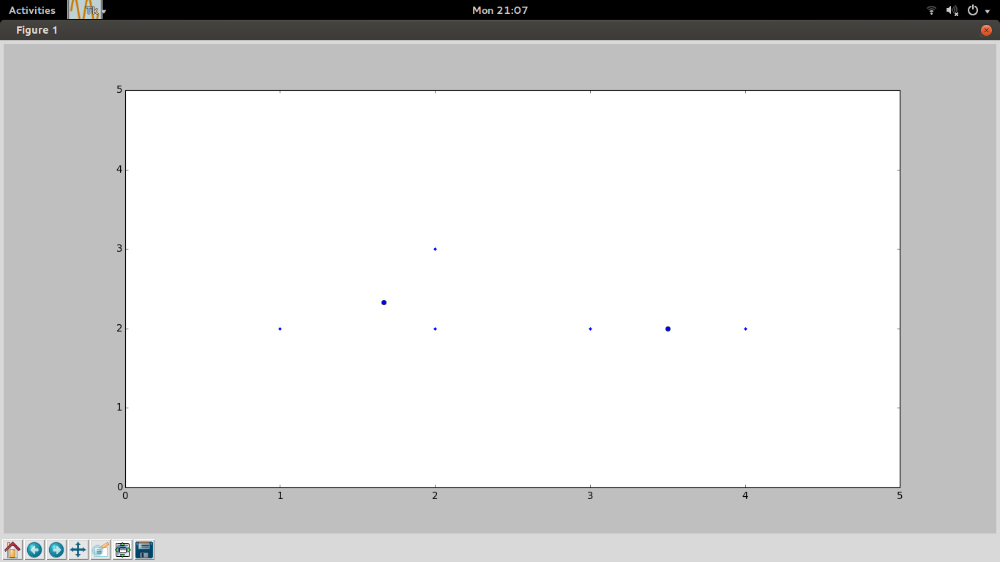

#Machine Learning Hacks
##To Run:
     python -m movieRecommendationSystem
     python -m clustering

##What each component does ?
######Movie Recommendation System
* User Based collabarative filtering
* how much will one user like a particular  movie
* Find similar movies
* Out of the people Who havent seen the movie Who will like this 

######Clustering
* Kmeans Clustering .
* Extracted Principal colors from the image .Its work in progress ,dont laugh :P

##REFERENCECS
*[Collective-Intelligence-Book](http://www.amazon.com/Programming-Collective-Intelligence-Building-Applications/dp/0596529325)
*[Color extractor](http://charlesleifer.com/blog/using-python-and-k-means-to-find-the-dominant-colors-in-images/)

